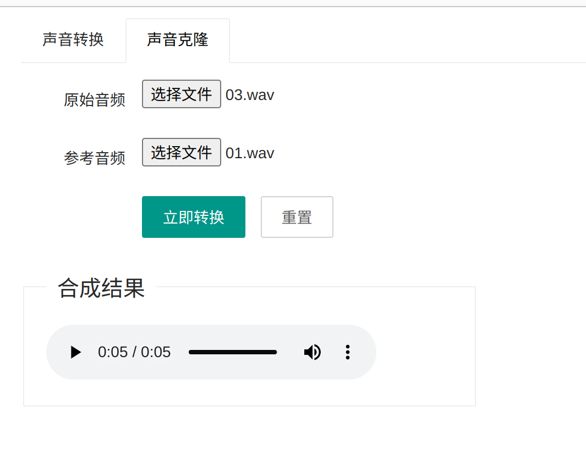

# 声音克隆
> 原项目地址：https://github.com/yl4579/StarGANv2-VC

> 备注： 用游戏角色的声音测试是正常的，不过用自己的声音测总感觉怪怪的，可能是我发音不标准吧。。。

## 效果演示




## 项目运行
### 模型下载

待开放

### 项目运行

```shell
pip install -r requirements.txt
python web.py
```

## 数据训练

数据集构成很简单，只需要音频以及对应的说话人即可，这里可以参考`dataset`目录下的训练文件和测试文件，按照我那个格式来即可

注意说话人必须使用数字来标识，然后要从0开始，我训练是随便找了原神里的20个人物，如果你的人物数不是20，需要修改`config.yaml`文件的`model_params.num_domains`参数

### 数据预处理
可以直接运行`pre-process.ipynb`来对音频进行降采样处理

### 开始训练
```shell
python train.py --config_path ./config/config.yml
```

### 效果验证
直接运行`inference.ipynb` 即可


## 遇到的问题
### module 'distutils' has no attribute 'version'
```shell
pip uninstall setuptools
pip install setuptools==59.5.0
```

### cannot load library 'libsndfile.so': libsndfile.so: cannot open shared object file: No such file or directory
```shell
apt install libsndfile1
```
